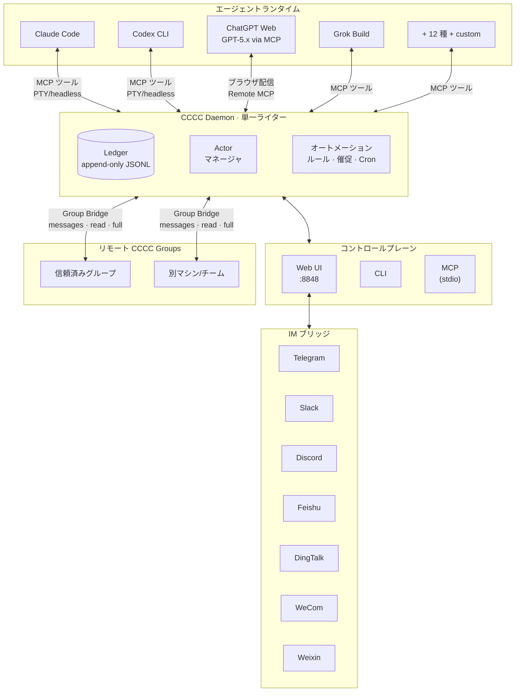

<div align="center">


# CCCC

### コーディングエージェントをグループチャットのように指揮する

**既読・送達トラッキング・リモートグループブリッジ・スマホ運用 —
Claude Code、Codex、ChatGPT Web など 17 のランタイムをひとつの永続グループで。**

複数のコーディングエージェントを、ランタイム・マシン・信頼済み working group をまたぐ**永続的で協調されたチーム**として運用 — バラバラのターミナルセッションではなく。

インストールコマンドひとつ。Rust ツールチェーンも追加インフラも不要です。

[](https://pypi.org/project/cccc-pair/)
[](Cargo.toml)
[](LICENSE)
[](https://chesterra.github.io/cccc/)

[English](README.md) | [中文](README.zh-CN.md) | **日本語**

</div>

---

<div align="center">

<a href="screenshots/overview.webp?raw=1" title="デスクトップ画像を原寸で表示"></a>
&nbsp;
<a href="screenshots/iphone.webp?raw=1" title="モバイル画像を原寸で表示"></a>

</div>

## なぜ CCCC か

複数のコーディングエージェントを使う現実はこうです：協調記録はターミナルのスクロールバッファに埋もれて再起動で消え、保存済み、runtime への引き渡し、Inbox での消費、返信が混同され、起動/停止/復旧はツールごとに分散し、外出先から稼働中のグループを確認する手段もない。これが、マルチエージェント環境が「脆いデモ」で終わってしまう根本原因です。

CCCC はエージェント群を、永続的で協調された 1 つのシステムとして運用します：

- **永続協調** — 作業状態はターミナルスクロールではなく、append-only ledger に残ります。
- **配信事実の可視化** — ルーティング、保存、runtime 配信、既読、返信を個別に記録し、「送信済み」を「確認済み」と扱いません。
- **1 つのコントロールプレーン** — Web UI、CLI、MCP、IM ブリッジがすべて同じ daemon 状態を共有します。
- **マルチランタイム前提** — Claude Code、Codex CLI、ChatGPT Web、Grok Build などの主要ランタイムを 1 つのグループで混在運用できます。
- **Group Bridge によるリモート連携** — 信頼済み CCCC group 同士が明示的なメッセージを交換し、許可された場合は相手のローカルリソースを調査・操作できます。
- **ローカルファースト運用** — インストールコマンドひとつで始められ、ランタイム状態は `CCCC_HOME` に置いたまま、必要時だけリモート監視へ広げられます。

## CCCC の役割

CCCC はコマンド一つで導入でき、データベース、メッセージブローカー、Docker は不要です。それでいて、壊れやすいマルチエージェント構成に足りない運用基盤を提供します：

| 機能 | 実現方法 |
|---|---|
| **唯一の事実源** | append-only ledger（`ledger.jsonl`）が全メッセージ・イベントを記録 — 再生可能、監査可能、喪失なし |
| **信頼性のあるメッセージング** | Send / Send + Reply / Mail、配信・既読・返信の事実を分離し、Mail 専用 Inbox を ledger 順で消費 — runtime への引き渡しを既読と偽りません |
| **統一コントロールプレーン** | Web UI、CLI、MCP ツール、IM ブリッジがすべて 1 つの daemon に接続 — 状態の分断なし |
| **マルチランタイム編成** | Claude Code、Cline CLI、Codex CLI、GitHub Copilot CLI、Cursor CLI、Devin CLI、Kiro CLI、Kilo Code CLI、Antigravity CLI、Grok Build、OpenCode、ChatGPT Web など 17 種の主要ランタイムを混在利用でき、さらに `custom` も扱える |
| **Group Bridge** | マシンやチームをまたぐ信頼済みリモートグループを接続し、明示的メッセージから始めて read/full のローカルアクセスを必要時だけ付与 |
| **ロールベース協調** | Foreman + Peer ロールモデル、権限境界と宛先ルーティング（`@all`、`@peers`、`@foreman`） |
| **ローカルファーストなランタイム状態** | ランタイムデータはリポジトリではなく `CCCC_HOME` に保持しつつ、Web Access と IM ブリッジで遠隔運用も可能 |

## クイックスタート

### インストール

```bash
# macOS / Linux（推奨）
curl -fsSL https://chesterra.github.io/cccc/install.sh | sh

# Windows CMD または PowerShell（推奨）
powershell.exe -NoProfile -ExecutionPolicy Bypass -Command "[Net.ServicePointManager]::SecurityProtocol = [Net.ServicePointManager]::SecurityProtocol -bor [Net.SecurityProtocolType]::Tls12; Invoke-RestMethod 'https://chesterra.github.io/cccc/install.ps1' | Invoke-Expression"

# pip 互換のネイティブ platform wheel
python -m pip install -U "cccc-pair>=0.4.36"
```

> **CCCC 0.4.36 の製品実装は Rust の 1 つだけです。** Web サイトのインストーラーを
> 推奨します。pip はパッケージマネージャー互換用で、同じネイティブ実行ファイルを
> platform wheel として導入します。Python daemon、launcher、fallback は含みません。
> 対応対象は Linux x86-64（glibc 2.28+）、Intel/Apple Silicon macOS 11+、
> Windows x86-64 です。

### アップグレード

```bash
# Web サイトインストーラーが所有する場合
cccc update

# pip が管理する場合
python -m pip install -U "cccc-pair>=0.4.36"
```

Web サイトインストーラーによる導入では、`cccc update --check` で更新元を確認
できます。pip 管理下のコマンドは standalone 自己更新を明示的に拒否し、代わりに
パッケージマネージャーのコマンドを表示します。どちらも同じネイティブ製品を
導入しますが、ファイルは作成元のインストーラーが管理し続けます。pip で更新する
前に `cccc daemon stop` を実行し、foreground の CCCC process も終了してください。
特に Windows では executable の置換に必要です。同じコマンドディレクトリを pip
から Web サイトインストーラーへ切り替える場合は、先に
`python -m pip uninstall cccc-pair` を実行してください。
`CCCC_ALLOW_REPLACE_EXISTING=1` を設定しても、pip 管理下のファイルは上書きしません。

### 起動

```bash
cccc
```

**http://127.0.0.1:8848** を開く — デフォルトで daemon とローカル Web UI が一緒に起動します。

```bash
cccc status            # 製品、daemon、group、actor、agent runtime を表示
cccc doctor            # インストールと実行環境を診断
cccc daemon status     # daemon のライフサイクル状態を明示的に確認
```

`cccc python`、`cccc rust`、旧 `ccccd` alias は廃止されました。既存の自動化は
`cccc daemon ...` を使用してください。daemon の状態ファイル名は互換性のため維持し、
Python runtime なしで 0.4.35 home を引き継げます。

### マルチエージェントグループの作成

```bash
cd /path/to/your/repo
cccc attach .                              # ディレクトリを scope として紐付け
cccc setup --runtime claude                # ランタイムの MCP を設定
cccc actor add foreman --runtime claude    # 最初の actor が foreman に
cccc actor add implementer --runtime codex # peer を追加
cccc group start                           # 全 actor を起動
cccc send "リポジトリを確認し、最初の安全なタスクを提案してください。" --to foreman
cccc tracked-send "最初の具体タスクを担当し、検証証拠を添えて返信してください。" \
  --to implementer \
  --title "最初の具体タスク" \
  --outcome "変更内容と検証証拠が報告されている"
```

これで 2 つのエージェントが永続グループ内で協調し、完全なメッセージ履歴、到達追跡、Web ダッシュボードを備えた状態になります。配信と協調は daemon が担い、ランタイム状態はリポジトリではなく `CCCC_HOME` に残ります。

**この時点で見えるはずのもの:** http://127.0.0.1:8848 の Web UI で両方の actor が実行中になり、foreman の返信が**チャット**に届き、tracked リクエストのメッセージに送達・既読ステータスが表示されます。actor が停止したままの場合は、まず `cccc doctor` でランタイムを確認し、よくある初回トラブルは [FAQ](https://chesterra.github.io/cccc/guide/faq) を参照してください。

## プログラマブル連携（SDK）

外部アプリやサービスから CCCC を連携する場合は、公式 SDK を利用してください:

```bash
pip install -U cccc-sdk
npm install cccc-sdk
cargo add cccc-sdk
```

SDK には daemon は含まれません。実行中の `cccc` 本体に接続して利用します。

## アーキテクチャ



**設計上の重要な決定：**

- **Daemon は単一ライター** — すべての状態変更が 1 つのプロセスを経由し、競合状態を排除
- **Ledger は append-only** — イベントは不変、履歴は信頼性が高くデバッグ可能
- **ポートは薄い** — Web、CLI、MCP、IM ブリッジはステートレスなフロントエンド；daemon が全真実を保持
- **リモートグループは明示的な信頼関係** — Group Bridge は message-only の協調から始まり、read/full アクセスはリモートグループごとに明示的に付与
- **ランタイムホーム `CCCC_HOME`**（デフォルト `~/.cccc/`）— ランタイム状態はリポジトリの外に保持

## サポートランタイム

CCCC は 17 種の主要ランタイムでエージェントを編成し、残りは `custom` で扱えます。同一グループ内で各 actor が異なるランタイムを使用可能です。

| ランタイム | 連携方式 | 入口 / サーフェス |
|-----------|----------|-------------------|
| Claude Code | MCP 自動設定 | `claude` |
| Cline CLI | MCP 自動設定 | `cline` |
| Codex CLI | MCP 自動設定 | `codex` |
| GitHub Copilot CLI | MCP 自動設定 | `copilot` |
| Cursor CLI | プロンプト支援 MCP 設定 | `cursor-agent` |
| Devin CLI | MCP 自動設定 | `devin` |
| Kiro CLI | MCP 自動設定 | `kiro-cli` |
| Kilo Code CLI | プロンプト支援 MCP 設定 | `kilo` |
| Antigravity CLI | プロンプト支援 MCP 設定 | `agy` |
| ChatGPT Web | Remote MCP + ブラウザ配信 | `chatgpt.com` conversation |
| Grok Build | MCP 自動設定 | `grok` |
| Hermes Agent | MCP 自動設定 | `hermes` |
| Droid | MCP 自動設定 | `droid` |
| Amp | MCP 自動設定 | `amp` |
| Auggie | MCP 自動設定 | `auggie` |
| Kimi CLI | MCP 自動設定 | `kimi` |
| OpenCode | ランタイム設定経由の MCP 自動設定 | `opencode` |
| Custom | 手動設定 | 任意のコマンド |

ここでは安定したランタイムの入口または利用サーフェスのみを示します。CCCC はランタイムごとの起動デフォルトを自動適用し、actor/profile のコマンドは設定で確認・変更できます。[サポートランタイムガイド](https://chesterra.github.io/cccc/guide/runtimes) には、`agy --dangerously-skip-permissions`、`grok --always-approve`、`opencode --auto` など、承認を省略する既定の autonomy flags も記載しています。

```bash
cccc setup --runtime claude       # ランタイムの MCP を自動設定
cccc setup --runtime cline        # Cline PTY TUI の MCP を自動設定
cccc setup --runtime cursor       # プロンプト支援 MCP 設定コントラクトを表示
cccc setup --runtime kilo         # プロンプト支援 MCP 設定コントラクトを表示
cccc setup --runtime antigravity  # プロンプト支援 MCP 設定コントラクトを表示
cccc runtime list --all           # 利用可能なランタイムを表示
cccc doctor                       # 環境とランタイムの可用性を検証
```

Actor は **PTY**（埋め込みターミナル）または **headless**（ターミナルなしの構造化 I/O）モードで実行できます。Claude Code と Codex CLI は両モードに対応。headless モードでは daemon が配信とストリーミングをより精密に制御します。

各サポートランタイムの setup コマンド、runner mode の指針、トラブルシュートは [サポートランタイムガイド](https://chesterra.github.io/cccc/guide/runtimes) を参照してください。

### ChatGPT Web / GPT-5.x をローカル開発 actor として

ChatGPT Web は外部チャットウィンドウではなく、実際の CCCC actor としてグループに参加できます。CCCC はブラウザ配信で紐付けた ChatGPT 会話へグループメッセージを届け、GPT-5.x は actor に紐付いた Remote MCP connector 経由で CCCC に接続します — ルーティングされたメッセージの受信、可視返信、リポジトリの確認/編集、scope 内の shell/git 実行まで、ネイティブなローカルコーディングエージェントに近い体験です。ChatGPT Web の余剰利用枠を、追加のローカル開発 agent 容量として活用することもできます。

セットアップには MCP connector 用の public HTTPS URL（Cloudflare Tunnel、ngrok、Tailscale Funnel、またはリバースプロキシ）が必要です。CCCC は安定したテキストのみの配信を既定とし、実験的な **GPT Pro** モードも提供します。このモードは、画像添付によって第三者 MCP が利用可能になる一部アカウント向けに、ごく小さな空白 PNG を各配信へ添付します。CCCC はモデルを切り替えず、ChatGPT の変更後もこの互換手段が動作し続けることを保証しません。詳細な設定とトラブルシュート: [ChatGPT Web Model Runtime](https://chesterra.github.io/cccc/guide/web-model-runtime)。

## Group Bridge: リモートグループを接続

Group Bridge は、CCCC を 1 つのローカル working group から、信頼済みグループのネットワークへ拡張します。Windows ワークステーション上の group を、WSL、Mac、サーバー、またはチームメイトの CCCC インスタンスと連携させても、ランタイム状態を混ぜる必要はなく、ローカルファーストなモデルも保てます。

アクセスは段階的に付与します：

| レベル | できること |
|--------|------------|
| **Messages** | 必要に応じて添付も含め、リモート foreman へ明示的な cross-group メッセージを送信 |
| **Read** | 信頼済みリモート group が remote MCP ツールでローカル context、リポジトリ、git 状態を調査 |
| **Full** | 高度に信頼したリモート group が、ネイティブ actor と同じローカルアクセス面でファイル編集やコマンド実行 |

これにより、複数マシンでの開発、複数環境をまたぐ lead/worker 協調、信頼済みチーム間でのステータス・証拠・実装支援の依頼が扱いやすくなります。これは公開ゲストアクセス機能ではありません。read/full は、対象ワークスペースを見せたり操作させたりしてよい相手にだけ付与してください。

Web UI の **Settings > Group Bridge** から開始します。一方が一回限りの pairing invitation を生成し、もう一方がそれを送信して、発行側がリクエストを承認します。承認後、remote group は明示的な宛先として表示され、agent は `cccc_remote_access(action="list")` で利用可能なアクセス権を確認できます。設定手順、メッセージフロー、remote MCP ツール、トラブルシュートは [Group Bridge ガイド](https://chesterra.github.io/cccc/guide/group-bridge) を参照してください。

## メッセージングと協調

CCCC は IM グレードのメッセージングセマンティクスを実装 — 「ターミナルにテキストを貼り付ける」だけではありません：

- **宛先ルーティング** — `@all`、`@peers`、`@foreman`、または特定の actor ID
- **明示的な 3 モード** — Send は能動配信、Send + Reply は具体的な返信要求、Mail は即時中断なしの Inbox 配信
- **事実の分離** — `runtime.delivery`、Mail 既読カーソル、返信、取消、タスク完了は互いを代用しません
- **消費型 Inbox 読取** — `cccc_inbox_read` が次の順序付き Mail バッチを返し、Mail カーソルを原子的に進めます
- **返信と引用** — 構造化された `reply_to` + 引用コンテキスト
- **返信要求** — Send + Reply は受信者の返信または送信者の取消まで追跡
- **ライフサイクル境界** — paused、stopped、disabled の actor を配信が暗黙に起動することはありません
- **リモートグループ宛先** — Group Bridge の対象は、隠れたブロードキャストではなく明示的な remote recipient として扱われます

待てる有用な agent 向け情報には Mail、遅延の損失が中断コストを上回る場合は Send、さらに具体的な回答が必要な場合だけ Send + Reply を使います。Mail は人間の user には送れません。1 件のメッセージは `user` のみ、または 1 人以上の agent のどちらか一方を宛先とし、両者へ必要な場合は別々に送信します。明確な担当者、完了条件、証拠、引き継ぎ、受け入れ履歴が必要な委任作業には `tracked-send` を使ってください。`@all` は告知や緊急の共有制約には使えますが、具体タスクのデフォルト分配先にはしません。

能動配信は daemon 管理のパイプラインを通り、その `runtime.delivery` 事実は Inbox の既読状態や返信とは分離されます。

## オートメーションとポリシー

少数の配信タイマーと自動化ルールが運用面を処理し、すべてのメッセージを prompt に変えることを避けます：

| ポリシー | 機能 |
|----------|------|
| **Mail 通知** | 宛先が明確な Mail に対し、設定時間後に本文なしの通知を最大 1 回送信 |
| **返信通知** | 配信済みの Send + Reply が未返信の場合に最大 1 回通知 |
| **Actor アイドル検出** | agent が沈黙した際に foreman に通知 |
| **Keepalive** | foreman への定期的なチェックインリマインダー |
| **沈黙検出** | グループ全体が静かになった場合にアラート |

内蔵ポリシーに加え、カスタムオートメーションルールを作成可能：

- **インターバルトリガー** — 「N 分ごとにスタンドアップリマインダーを送信」
- **Cron スケジュール** — 「平日毎朝 9 時にステータスチェックを投稿」
- **ワンタイムトリガー** — 「今日 17 時にグループを一時停止」
- **運用アクション** — グループ状態の設定や actor ライフサイクルの制御（管理者のみ、ワンタイムのみ）

## Web UI

内蔵 Web UI `http://127.0.0.1:8848` の機能：

- **チャットビュー** — `@mention` オートコンプリートとリプライスレッド
- **actor ごとの埋め込みターミナル**（xterm.js）— 各 agent の作業状況をリアルタイムで確認
- **グループ & actor 管理** — 作成、設定、起動、停止、再起動
- **オートメーションルールエディター** — トリガー、スケジュール、アクションを視覚的に設定
- **Context パネル** — 共有ビジョン、スケッチ、マイルストーン、タスク
- **Group Space** — NotebookLM 統合による共有ナレッジ管理
- **ChatGPT Web Model 設定** — 1 つの ChatGPT Web 会話を CCCC actor として接続
- **Group Bridge 設定** — 信頼済みリモートグループをペアリングし、接続ごとに messages/read/full アクセスを選択
- **IM ブリッジ設定** — Telegram/Slack/Discord/Feishu/DingTalk/WeCom/Weixin に接続
- **設定** — メッセージングポリシー、配信チューニング、ターミナルトランスクリプト制御
- **テキストスケール** — 90% / 100% / 125% フォントサイズ、ブラウザごとに永続化
- **ライト / ダーク / システムテーマ**

### リモートアクセス

localhost 外から Web UI にアクセスする場合：

- **LAN / プライベートネットワーク** — 全ローカルインターフェースにバインド：`CCCC_WEB_HOST=0.0.0.0 cccc`
- **Cloudflare Tunnel**（推奨）— `cloudflared tunnel --url http://127.0.0.1:8848`
- **Tailscale** — tailnet IP にバインド：`CCCC_WEB_HOST=$TAILSCALE_IP cccc`
- ローカル以外へ公開する前に、まず **Settings > Web Access** で **Admin Access Token** を作成し、その完了まではネットワーク境界で保護してください。
- **Settings > Web Access** で `127.0.0.1` はローカルのみ、`0.0.0.0` は localhost + LAN IP を意味します。CCCC が WSL2 のデフォルト NAT ネットワーク内で動作している場合、`0.0.0.0` は WSL 内部にのみ公開されます。LAN デバイスからのアクセスには WSL mirrored networking または Windows portproxy/ファイアウォールルールが必要です。
- `Save` はターゲットバインディングを保存します。Web が `cccc` または `cccc web` で起動された場合は、**Settings > Web Access** の `Apply now` で短い監視付き再起動を実行してください。Docker、systemd 等の外部スーパーバイザが管理している場合は、そのサービスを再起動してください。
- `Start` / `Stop` は Tailscale リモートアクセス専用で、既に稼働中の Web ソケットのリバインドは行いません。
- トークンポリシーは意図的に階層化されています：localhost のみの場合はシンプルに、LAN/プライベート公開ではデフォルトで Access Token が必要、公開 URL/トンネル公開では Access Token が必須です。

## IM ブリッジ

Working Group を IM プラットフォームにブリッジ：

```bash
cccc im set telegram --token-env TELEGRAM_BOT_TOKEN
cccc im start
```

| プラットフォーム | ステータス |
|-----------------|-----------|
| Telegram | ✅ 対応済み |
| Slack | ✅ 対応済み |
| Discord | ✅ 対応済み |
| Feishu / Lark | ✅ 対応済み |
| DingTalk | ✅ 対応済み |
| WeCom / 企業微信 | ✅ 対応済み |
| Weixin / 微信 | ✅ 対応済み |

> Telegram、Slack、Discord、Feishu、DingTalk、WeCom は段階的な返信に対応し、長すぎる結果は欠落のない分割済み最終メッセージへフォールバックします。Weixin は欠落のない最終メッセージを配信し、現在はボットとのダイレクトチャットのみ対応しています。

任意の対応プラットフォームから、通常の調整にはプレーンテキストまたは `/send @foreman <メッセージ>` を使い、真のブロードキャストだけ `/send @all <メッセージ>` を使います。`/status` でグループ状態を確認し、`/pause` / `/resume` で運用を制御できます — すべてスマートフォンから。

## CLI リファレンス

```bash
# ライフサイクル
cccc                           # daemon + Web UI を起動
cccc daemon start|status|stop  # daemon 管理

# グループ
cccc attach .                  # カレントディレクトリを紐付け
cccc groups                    # 全グループを一覧
cccc use <group_id>            # アクティブグループを切り替え
cccc group start|stop          # 全 actor を起動/停止

# Actor
cccc actor add <id> --runtime <runtime>
cccc actor start|stop|restart <id>

# メッセージング
cccc send "メッセージ" --to foreman
cccc tracked-send "委任作業" --to implementer --title "タスクタイトル" --outcome "完了条件"
cccc send "告知" --to @all  # 明示的なブロードキャスト
cccc reply <event_id> "返信"
cccc tail -n 50 -f             # ledger をリアルタイム追跡

# 受信箱
cccc inbox --actor-id <id>     # 次の未読 Mail バッチを読み取り、消費する

# 運用
cccc doctor                    # 環境チェック
cccc setup --runtime <name>    # MCP を設定
cccc runtime list --all        # 利用可能なランタイム

# IM
cccc im set <platform> --token-env <ENV_VAR>
cccc im start|stop|status
```

## MCP ツール

エージェントは、コンパクトな action-oriented MCP surface を通じて CCCC と対話します。コアツールは常時公開され、追加サーフェスは必要時のみ capability pack 経由で有効化されます。

| サーフェス | 例 |
|------------|----|
| **セッションとガイダンス** | `cccc_bootstrap`、`cccc_help`、`cccc_project_info` |
| **メッセージングとファイル** | `cccc_inbox_read`、`cccc_message_history`、`cccc_message_send`、`cccc_message_reply`、`cccc_file` |
| **グループと actor 制御** | `cccc_group`、`cccc_actor` |
| **協調と状態** | `cccc_context_get`、`cccc_coordination`、`cccc_task`、`cccc_agent_state`、`cccc_context_sync` |
| **リモートグループアクセス** | `cccc_remote_access`、`cccc_remote_context`、`cccc_remote_repo`、`cccc_remote_git`、`cccc_remote_apply_patch`、`cccc_remote_exec_command` |
| **オートメーションと記憶** | `cccc_automation`、`cccc_memory`、`cccc_memory_admin` |
| **必要時のみの拡張** | `cccc_capability_*`、`cccc_space`、`cccc_terminal`、`cccc_debug`、`cccc_im_bind` |

MCP アクセスを持つエージェントは、権限境界の中で自己組織化できます。受信箱の確認、可視返信、タスク協調、自己状態更新、そして必要なときだけの追加能力有効化が可能です。

## CCCC の位置づけ

| シナリオ | 適合度 |
|----------|--------|
| 複数のコーディングエージェントが 1 つのコードベースで協調 | ✅ コアユースケース |
| 人間 + エージェントの協調、完全な監査証跡付き | ✅ コアユースケース |
| 長時間稼働グループをスマートフォン/IM でリモート管理 | ✅ 強い適合 |
| マルチランタイムチーム（例：Claude + Codex + Kimi） | ✅ 強い適合 |
| 信頼済みグループがマシンやチームをまたいで協調 | ✅ 強い適合 |
| 単一エージェントのローカルコーディングヘルパー | ⚠️ 動作するが、CCCC の価値は複数参加者で発揮 |
| 純粋な DAG ワークフローオーケストレーション | ❌ 専用オーケストレーターを使用；CCCC は補完的に利用可能 |

CCCC は**協調カーネル** — 協調レイヤーを担い、外部の CI/CD、オーケストレーター、デプロイツールとの組み合わせを維持します。

## 他のアプローチとの比較

| すでに使っているもの | その強み | CCCC が加えるもの |
|---|---|---|
| **ネイティブのエージェントチーム**（例：Claude Code subagents/teams） | 単一ベンダー・単一セッション内で最もスムーズな連携 | ベンダー横断のグループ（Claude + Codex + Grok + Kimi…）、再起動後も残る状態、スマホ/IM からの運用、完全な監査 ledger |
| **並列タスクランナー**（worktree/タスクボード系ツール） | 隔離された並列タスク実行 | 協調レイヤー：エージェント同士が対話・引き継ぎ・割り込みレベルを選択し、有界なリマインダーを受ける — さらに 24/7 の daemon 運用 |
| **IM アシスタントゲートウェイ** | チャットアプリに住む個人アシスタント | 実作業向けの配信セマンティクス：tracked task、配信/既読/返信の事実、マルチエージェントグループ、永続監査証跡 |

CCCC はエージェントを置き換えるものではなく、それらをチームにするレイヤーです。詳しい議論: [FAQ — 他ツールとの比較](https://chesterra.github.io/cccc/guide/faq#how-does-cccc-compare-to-native-agent-teams-and-other-tools)

## セキュリティ

- **Web UI は高権限。** ローカル以外へ公開する前に、まず **Settings > Web Access** で **Admin Access Token** を作成してください。
- **Daemon IPC は認証なし。** デフォルトで localhost にのみバインド。
- **IM ボットトークン** は環境変数から読み取り、設定ファイルには保存しない。
- **ランタイム状態** は `CCCC_HOME`（`~/.cccc/`）に保持、リポジトリ内には置かない。
- **Group Bridge は信頼ベースの接続です。** message-only が最も安全なデフォルトであり、read/full は対象ワークスペースの調査や操作を任せられるリモート group にだけ付与してください。
- **Capability allowlist** がエージェントの有効化できるオプション MCP サーフェスを管理。ポリシーはパッケージ内のデフォルトと `CCCC_HOME/config/` のユーザーオーバーレイで構成。

詳細なセキュリティガイダンスは [SECURITY.md](SECURITY.md) を参照。

## ドキュメント

📚 **[完全なドキュメント](https://chesterra.github.io/cccc/)**

| セクション | 説明 |
|-----------|------|
| [クイックスタート](https://chesterra.github.io/cccc/guide/getting-started/) | インストール、起動、最初のグループ作成 |
| [ユースケース](https://chesterra.github.io/cccc/guide/use-cases) | 実践的なマルチエージェントシナリオ |
| [Web UI ガイド](https://chesterra.github.io/cccc/guide/web-ui) | ダッシュボードのナビゲーション |
| [IM ブリッジ設定](https://chesterra.github.io/cccc/guide/im-bridge/) | Telegram、Slack、Discord、Feishu、DingTalk、WeCom、Weixin の接続 |
| [Group Space](https://chesterra.github.io/cccc/guide/group-space-notebooklm) | NotebookLM ナレッジ統合 |
| [ChatGPT Web Model Runtime](https://chesterra.github.io/cccc/guide/web-model-runtime) | MCP 対応 ChatGPT Web を CCCC actor として接続。任意の実験的 GPT Pro モードでは小さな空白 PNG を添付します |
| [Capability Allowlist](https://chesterra.github.io/cccc/guide/capability-allowlist) | MCP 機能ガバナンス |
| [ベストプラクティス](https://chesterra.github.io/cccc/guide/best-practices) | 推奨パターンとワークフロー |
| [FAQ](https://chesterra.github.io/cccc/guide/faq) | よくある質問 |
| [運用ランブック](https://chesterra.github.io/cccc/guide/operations) | 復旧、トラブルシューティング、メンテナンス |
| [CLI リファレンス](https://chesterra.github.io/cccc/reference/cli) | 完全なコマンドリファレンス |
| [SDK（Python/TypeScript/Rust）](https://github.com/ChesterRa/cccc-sdk) | 公式クライアントでアプリ/サービスから daemon を利用 |
| [アーキテクチャ](https://chesterra.github.io/cccc/reference/architecture) | 設計決定とシステムモデル |
| [機能詳細](https://chesterra.github.io/cccc/reference/features) | メッセージング、オートメーション、ランタイムの詳細 |
| [CCCS 標準](docs/standards/CCCS_V1.md) | 協調プロトコル仕様 |
| [Daemon IPC 標準](docs/standards/CCCC_DAEMON_IPC_V1.md) | IPC プロトコル仕様 |

## インストールオプション

### Web サイトインストーラー（推奨）

```bash
# macOS / Linux
curl -fsSL https://chesterra.github.io/cccc/install.sh | sh

# Windows CMD または PowerShell
powershell.exe -NoProfile -ExecutionPolicy Bypass -Command "[Net.ServicePointManager]::SecurityProtocol = [Net.ServicePointManager]::SecurityProtocol -bor [Net.SecurityProtocolType]::Tls12; Invoke-RestMethod 'https://chesterra.github.io/cccc/install.ps1' | Invoke-Expression"
```

GitHub Releases からチェックサム検証済みのネイティブ製品を取得し、同じ
インストーラーで `cccc update` できます。インストーラーは
自身が所有しない既存の `cccc`
コマンドを上書きしないため、意図的にアンインストールするか、別の
`CCCC_INSTALL_DIR` を指定してください。
別ディレクトリにある同名コマンドは変更しません。デフォルトのインストール先では、
新しいコマンドをユーザー PATH の先頭に置き、残っている重複コマンドを表示します。
新しいターミナルで `cccc doctor` を実行すると、`Installation` セクションに
実行中の入口、PATH が選ぶコマンド、競合するすべてのパスが表示されます。

インストーラーは、`CCCC_VERSION` を明示しない限り、現在公開中の安定版を
選択します。

### pip 互換インストール（v0.4.36 以降）

```bash
python -m pip install -U "cccc-pair>=0.4.36"
```

Pip は同じ `cccc` 実行ファイルを含む 0.4.36 以降の platform wheel を導入します。
最低 version 制約により、現在の platform に 0.4.36 wheel がない場合に過去の
Python 版が暗黙に選ばれることを防ぎます。0.4.36 では sdist、universal wheel、
import 可能な CCCC Python package、fallback 実装を提供しないため、未対応
platform は解決に失敗します。汎用の `pip install .` source build も空 package を
導入せず明示的に拒否されます。`pip install -e .` も開発入口ではないため、下記の
source build コマンドを使用してください。

Cargo インストールは workspace 開発用にのみ残し、サポート対象のエンドユーザー
配布にはしません。

### ソースから

source package の作成には Rust 1.88+、npm 付き Node.js 24、および archive helper
専用の Python 3.11+ が必要です。build 済み CCCC product に Python は含まれません。

```bash
git clone https://github.com/ChesterRa/cccc
cd cccc
./scripts/build_package.sh
./target/release/cccc --version
./target/release/cccc
```

反復的なデバッグには
`cargo run --locked --features standalone -p cccc --bin cccc -- --port 0` を使用します。
Windows では
`powershell.exe -NoProfile -ExecutionPolicy Bypass -File .\scripts\build_package.ps1`
を実行し、その後 `.\target\release\cccc.exe` を起動します。

### Windows ネイティブ

- `scripts/build_package.ps1` は lock 済み Web 依存関係を導入し、Web bundle を
  埋め込み、ネイティブ実行ファイルと archive を作成します。
- `x86_64-pc-windows-msvc` Rust toolchain を使用し、ビルド後に生成された
  `cccc.exe doctor` を実行してください。

### Docker

```bash
cd docker
docker compose up -d  # その後 Settings > Web Access で Admin Access Token を作成してから公開
```

Docker イメージには Claude Code、Codex CLI、Factory CLI がバンドル済み。完全な設定は [`docker/`](docker/) を参照。

### 0.3.x からのアップグレード

0.4.x はゼロからの書き直しです。先にクリーンアンインストール：

```bash
pipx uninstall cccc-pair || true
pip uninstall cccc-pair || true
rm -f ~/.local/bin/cccc ~/.local/bin/ccccd
```

再インストール後、`cccc doctor` で環境を確認。

> tmux-first の 0.3.x は [cccc-tmux](https://github.com/ChesterRa/cccc-tmux) にアーカイブ済み。

## コミュニティ

Telegram コミュニティ: [t.me/ccccpair](https://t.me/ccccpair)

ワークフローの共有、課題の相談、他の CCCC ユーザーとの情報交換にご活用ください。

## コントリビューション

コントリビューションを歓迎します：

1. 新しい Issue を開く前に既存の [Issues](https://github.com/ChesterRa/cccc/issues) を確認
2. バグ報告：`cccc version`、OS、正確なコマンド、再現手順を含める
3. 機能リクエスト：問題、提案する動作、運用への影響を記述
4. ランタイム状態は `CCCC_HOME` に保持 — リポジトリにコミットしない

## License

[Apache-2.0](LICENSE)
