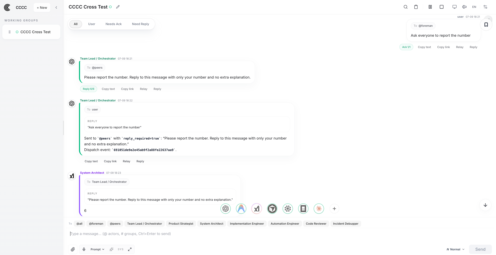
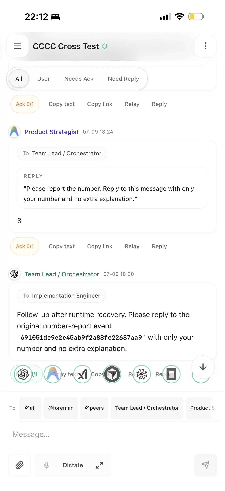
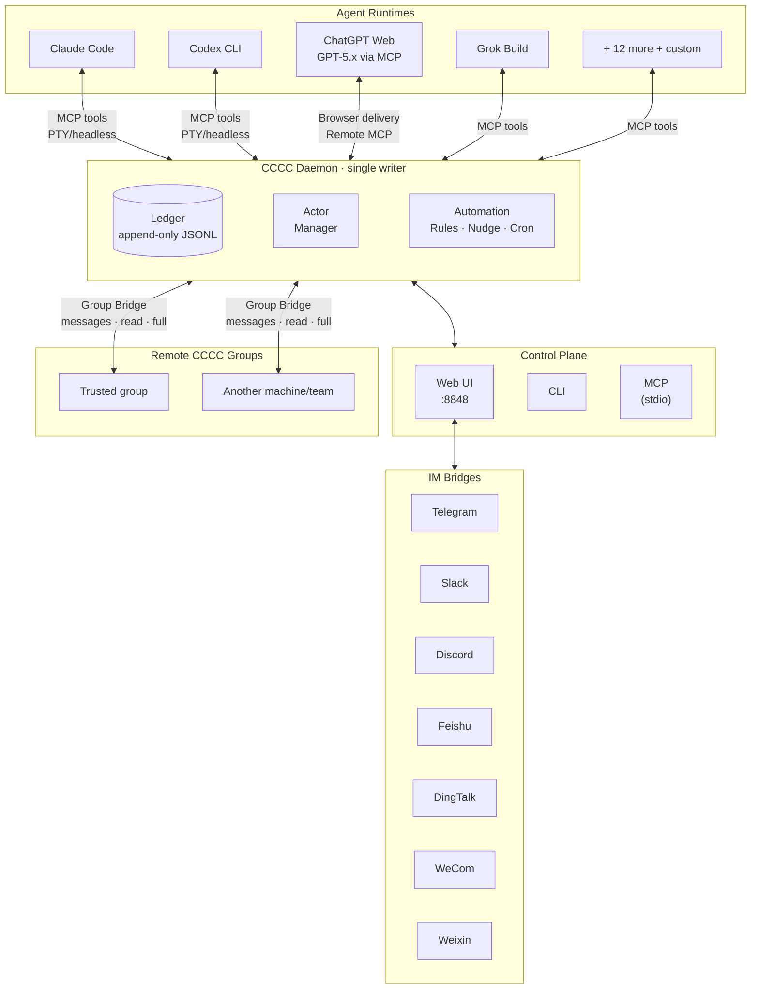

<div align="center">


# CCCC

### Coordinate your coding agents like a group chat

**Read receipts, delivery tracking, remote group bridges, and mobile ops —
for Claude Code, Codex, ChatGPT Web, and 13 more runtimes in one durable group.**

Run multiple coding agents as a **persistent, coordinated team** across runtimes, machines, and trusted working groups — not a pile of disconnected terminal sessions.

One install command. No Rust toolchain or infrastructure required.

[](https://pypi.org/project/cccc-pair/)
[](Cargo.toml)
[](LICENSE)
[](https://chesterra.github.io/cccc/)

**English** | [中文](README.zh-CN.md) | [日本語](README.ja.md)

</div>

---

<div align="center">

<a href="screenshots/overview.webp?raw=1" title="View desktop screenshot at full size"></a>
&nbsp;
<a href="screenshots/iphone.webp?raw=1" title="View mobile screenshot at full size"></a>

</div>

## Why CCCC

Using multiple coding agents today usually means lost context in terminal scrollback, no distinction between a stored message, runtime handoff, Inbox consumption, and a reply, start/stop/recover operations scattered across tools, and no way to check on a long-running group from your phone. That's why most multi-agent setups stay fragile demos instead of reliable workflows.

CCCC runs your agents as one durable, coordinated system:

- **Durable coordination** — working state lives in an append-only ledger, not in terminal scrollback.
- **Visible delivery semantics** — routing plus separate stored, runtime-delivery, read, and reply facts replace best-effort prompting.
- **One control plane** — Web UI, CLI, MCP, and IM bridges all operate on the same daemon-owned state.
- **Multi-runtime by default** — Claude Code, Codex CLI, ChatGPT Web, Grok Build, and the rest of the first-class runtimes can collaborate in one group.
- **Group Bridge for remote teams** — trusted CCCC groups can exchange explicit messages and, when granted, inspect or work with each other's local resources.
- **Local-first operations** — one install command, runtime state in `CCCC_HOME`, and remote supervision only when you choose to expose it.

## What CCCC Does

CCCC installs with one command and needs no database, message broker, or Docker. Yet it gives you the pieces fragile multi-agent setups usually lack:

| Capability | How |
|---|---|
| **Single source of truth** | Append-only ledger (`ledger.jsonl`) records every message and event — replayable, auditable, never lost |
| **Reliable messaging** | Send / Send + Reply / Mail, separate delivery/read/reply facts, and a Mail-only Inbox consumed in ledger order — runtime handoff never pretends a message was read |
| **Unified control plane** | Web UI, CLI, MCP tools, and IM bridges all talk to one daemon — no state fragmentation |
| **Multi-runtime orchestration** | Claude Code, Codex CLI, GitHub Copilot CLI, Cursor CLI, Devin CLI, Kiro CLI, Kilo Code CLI, Antigravity CLI, Grok Build, OpenCode, ChatGPT Web, and 5 more first-class runtimes, plus `custom` for everything else |
| **Group Bridge** | Connect trusted remote groups across machines or teams, starting with explicit messages and optionally granting read/full local access |
| **Role-based coordination** | Foreman + peer model with permission boundaries and recipient routing (`@all`, `@peers`, `@foreman`) |
| **Local-first runtime state** | Runtime data stays in `CCCC_HOME`, not your repo, while Web Access and IM bridges cover remote operations |


## Quick Start

### Install

```bash
# macOS / Linux (recommended)
curl -fsSL https://chesterra.github.io/cccc/install.sh | sh

# Windows CMD or PowerShell (recommended)
powershell.exe -NoProfile -ExecutionPolicy Bypass -Command "[Net.ServicePointManager]::SecurityProtocol = [Net.ServicePointManager]::SecurityProtocol -bor [Net.SecurityProtocolType]::Tls12; Invoke-RestMethod 'https://chesterra.github.io/cccc/install.ps1' | Invoke-Expression"

# Native platform wheel (pip compatibility)
python -m pip install -U "cccc-pair>=0.4.36"
```

> **CCCC 0.4.36 has one product implementation: Rust.** The website installer is
> recommended. The pip command installs the same native executable in a
> platform wheel for package-manager compatibility; it does not install a
> Python daemon, launcher, or fallback. Supported targets are Linux x86-64
> (glibc 2.28+), Intel/Apple Silicon macOS 11+, and Windows x86-64.

### Upgrade

```bash
# Website-installer ownership
cccc update

# pip ownership
python -m pip install -U "cccc-pair>=0.4.36"
```

Use `cccc update --check` to inspect a website-installer deployment before
updating it. A pip-owned command deliberately refuses standalone self-update
and prints the package-manager command instead. Both channels install the same
native product, but each remains owned by the installer that created it. Before
a pip upgrade, run `cccc daemon stop` and close any foreground CCCC process so
the package manager can replace the executable, especially on Windows. To
switch from pip to the website installer in the same command directory, first
run `python -m pip uninstall cccc-pair`; the standalone installer deliberately
refuses to overwrite pip-owned files, even with
`CCCC_ALLOW_REPLACE_EXISTING=1`.

### Launch

```bash
cccc
```

Open **http://127.0.0.1:8848** — by default, CCCC brings up the daemon and the local Web UI together.
Direct `localhost` / `127.0.0.1` use stays passwordless and does not create an Access Token.
Explicit Admin Access Tokens are required only when enabling LAN, Reach, public URL, or
reverse-proxied access.

```bash
cccc status            # product, daemon, groups, actors, and agent runtimes
cccc doctor            # installation and environment diagnostics
cccc daemon status     # explicit daemon lifecycle status
```

`cccc python`, `cccc rust`, and the former `ccccd` alias are retired. Existing
automation should use `cccc daemon ...`; compatible daemon state filenames are
retained so 0.4.35 homes can be adopted without a Python runtime.

### Create a multi-agent group

```bash
cd /path/to/your/repo
cccc attach .                              # bind this directory as a scope
cccc setup                                 # configure all available runtimes (or select one with --runtime)
cccc actor add foreman --runtime claude    # first actor becomes foreman
cccc actor add implementer --runtime codex # add a peer
cccc group start                           # start all actors
cccc send "Please inspect the repo and propose the first safe task." --to foreman
cccc tracked-send "Please take the first concrete task and reply with validation evidence." \
  --to implementer \
  --title "First concrete task" \
  --outcome "The change and validation evidence are reported"
```

You now have two agents collaborating in a persistent group with full message history, delivery tracking, and a web dashboard. The daemon owns delivery and coordination, and runtime state stays in `CCCC_HOME` rather than inside your repo.

**What you should see:** in the Web UI at http://127.0.0.1:8848, both actors show as running, the foreman's reply arrives in **Chat**, and the tracked request displays its delivery and read state on the message. If an actor stays stopped, run `cccc doctor` to check the runtime, and see the [FAQ](https://chesterra.github.io/cccc/guide/faq) for common first-run fixes.

## Programmatic Access (SDK)

Use the official SDK when you need to integrate CCCC into external applications or services:

```bash
pip install -U cccc-sdk
npm install cccc-sdk
cargo add cccc-sdk
```

The SDK does not include a daemon. It connects to a running `cccc` core instance.

## Architecture



**Key design decisions:**

- **Daemon is the single writer** — all state changes go through one process, eliminating race conditions
- **Ledger is append-only** — events are never mutated, making history reliable and debuggable
- **Ports are thin** — Web, CLI, MCP, and IM bridges are stateless frontends; the daemon owns all truth
- **Remote groups are explicit trust edges** — Group Bridge starts with message-only coordination, and read/full access must be granted per remote group
- **Runtime home is `CCCC_HOME`** (default `~/.cccc/`) — runtime state stays out of your repo

## Supported Runtimes

CCCC orchestrates agents across 17 first-class runtimes, with `custom` available for everything else. Each actor in a group can use a different runtime.

| Runtime | Integration | Entrypoint / Surface |
|---------|-------------|----------------------|
| Claude Code | Auto MCP setup | `claude` |
| Cline CLI | Auto MCP setup | `cline` |
| Codex CLI | Auto MCP setup | `codex` |
| GitHub Copilot CLI | Auto MCP setup | `copilot` |
| Cursor CLI | Prompt-assisted MCP setup | `cursor-agent` |
| Devin CLI | Auto MCP setup | `devin` |
| Kiro CLI | Auto MCP setup | `kiro-cli` |
| Kilo Code CLI | Prompt-assisted MCP setup | `kilo` |
| Antigravity CLI | Prompt-assisted MCP setup | `agy` |
| ChatGPT Web | Remote MCP + Browser Delivery | `chatgpt.com` conversation |
| Grok Build | Auto MCP setup | `grok` |
| Hermes Agent | Auto MCP setup | `hermes` |
| Droid | Auto MCP setup | `droid` |
| Amp | Auto MCP setup | `amp` |
| Auggie | Auto MCP setup | `auggie` |
| Kimi CLI | Auto MCP setup | `kimi` |
| OpenCode | Auto MCP setup via runtime config | `opencode` |
| Custom | Manual | Any command |

These are stable runtime entrypoints or surfaces. CCCC applies runtime-specific launch defaults automatically; actor/profile commands can be reviewed and customized in settings. The [Supported Runtimes guide](https://chesterra.github.io/cccc/guide/runtimes) lists the default autonomy flags, including approval-bypass modes such as `agy --dangerously-skip-permissions`, `grok --always-approve`, and `opencode --auto`.

```bash
cccc setup --runtime claude       # auto-configures MCP for this runtime
cccc setup --runtime cline        # configures Cline CLI MCP for its PTY TUI
cccc setup --runtime cursor       # shows the prompt-assisted MCP setup contract
cccc setup --runtime kilo         # shows the prompt-assisted MCP setup contract
cccc setup --runtime antigravity  # shows the prompt-assisted MCP setup contract
cccc runtime list --all           # show all available runtimes
cccc doctor                       # verify environment and runtime availability
```

Actors can run as **PTY** (embedded terminal) or **headless** (structured I/O without a terminal). Claude Code and Codex CLI support both modes; headless gives the daemon tighter delivery and streaming control.

For setup commands, runner-mode guidance, and troubleshooting for every supported runtime, see the [Supported Runtimes guide](https://chesterra.github.io/cccc/guide/runtimes).

### ChatGPT Web / GPT-5.x as a local development actor

ChatGPT Web can join a CCCC group as a real actor, not just an external chat window: CCCC delivers group messages into one bound ChatGPT conversation via browser delivery, and GPT-5.x calls back through an actor-bound remote MCP connector — receiving routed messages, replying visibly, editing repository files, and running scoped shell/git commands much like a native local coding agent. This also turns spare ChatGPT Web capacity into additional local-development agent capacity.

Setup requires exposing CCCC through a public HTTPS URL for the MCP connector (Cloudflare Tunnel, ngrok, Tailscale Funnel, or a reverse proxy). CCCC defaults to stable text-only delivery and also offers an experimental **GPT Pro** mode that attaches a tiny blank PNG when delivering each batch. This compatibility workaround does not switch ChatGPT models or guarantee connector availability, and may stop working when ChatGPT changes. Full setup and troubleshooting: [ChatGPT Web Model Runtime](https://chesterra.github.io/cccc/guide/web-model-runtime).

## Group Bridge: connect remote groups

Group Bridge extends CCCC from one local working group into a network of trusted groups. A group on your Windows workstation can coordinate with a group in WSL, a Mac, a server, or a teammate's CCCC instance without merging their runtime state or losing the local-first model.

Access is intentionally layered:

| Level | What it enables |
|-------|-----------------|
| **Messages** | Send explicit cross-group messages to the remote foreman, including attachments when needed |
| **Read** | Let a trusted remote group inspect local context, repository, and git state through remote MCP tools |
| **Full** | Let a highly trusted remote group edit files and run commands through the same local-access surface used by native actors |

This makes CCCC useful for multi-machine work, lead/worker coordination across several environments, or trusted team collaboration where one group needs to ask another group for status, evidence, or implementation help. It is not a public guest-access feature: grant read/full access only to remote groups you trust with the target workspace.

Start from **Settings > Group Bridge** in the Web UI: one side generates a one-time pairing invitation, the other side submits it, and the issuer approves the request. After approval, remote groups appear as explicit recipients, and agents can discover available access with `cccc_remote_access(action="list")`. For setup steps, message flow, remote MCP tools, and troubleshooting, see the [Group Bridge guide](https://chesterra.github.io/cccc/guide/group-bridge).

## Messaging & Coordination

CCCC implements IM-grade messaging semantics, not just "paste text into a terminal":

- **Recipient routing** — `@all`, `@peers`, `@foreman`, or specific actor IDs
- **Three explicit modes** — Send for active delivery, Send + Reply for a concrete response, and Mail for non-interrupting Inbox delivery
- **Separate facts** — `runtime.delivery`, Mail read cursors, replies, cancellations, and task completion never impersonate one another
- **Consuming Inbox reads** — `cccc_inbox_read` returns the next ordered Mail batch and advances its Mail cursor atomically
- **Reply & quote** — structured `reply_to` with quoted context
- **Reply requests** — Send + Reply is tracked until the recipient responds or the sender cancels it
- **Lifecycle boundaries** — paused, stopped, or disabled actors are not silently awakened by delivery
- **Remote group recipients** — Group Bridge targets appear as explicit remote recipients instead of hidden broadcasts

Use Mail for useful agent updates that can wait, Send when delayed awareness would cost more than interrupting the recipient, and Send + Reply only when a concrete answer is also required. Mail cannot target the human user. One message addresses either `user` alone or one/more agents—send separate messages instead of mixing those audiences. Use `tracked-send` when delegated work needs a durable owner, outcome, evidence, handoff, or acceptance trail. `@all` remains available for announcements or urgent shared coordination, but it should not be the default way to start concrete work.

Push attempts travel through the daemon-managed delivery pipeline. Their `runtime.delivery` facts remain separate from Inbox read state and replies.

## Automation & Policies

A small set of delivery timers and automation rules handles operational concerns without turning every message into a prompt:

| Policy | What it does |
|--------|-------------|
| **Mail notice** | Sends at most one content-free reminder after a configurable wait for concrete-recipient Mail |
| **Reply notice** | Sends at most one reminder for an accepted Send + Reply whose reply is still open |
| **Actor idle detection** | Notifies foreman when an agent goes silent |
| **Keepalive** | Periodic check-in reminders for the foreman |
| **Silence detection** | Alerts when an entire group goes quiet |

Beyond built-in policies, you can create custom automation rules:

- **Interval triggers** — "every N minutes, send a standup reminder"
- **Cron schedules** — "every weekday at 9am, post a status check"
- **One-time triggers** — "at 5pm today, pause the group"
- **Operational actions** — set group state or control actor lifecycles (admin-only, one-time only)

## Web UI

The built-in Web UI at `http://127.0.0.1:8848` provides:

- **Chat view** with `@mention` autocomplete and reply threading
- **Per-actor embedded terminals** (xterm.js) — see exactly what each agent is doing
- **Group & actor management** — create, configure, start, stop, restart
- **Automation rule editor** — configure triggers, schedules, and actions visually
- **Context panel** — shared vision, sketch, milestones, and tasks
- **Group Space** — NotebookLM integration for shared knowledge management
- **ChatGPT Web Model setup** — connect one ChatGPT Web conversation as a CCCC actor
- **Group Bridge setup** — pair trusted remote groups and choose message/read/full access per connection
- **IM bridge configuration** — connect to Telegram/Slack/Discord/Feishu/DingTalk/WeCom/Weixin
- **Settings** — messaging policies, delivery tuning, terminal transcript controls
- **Text scale** — 90% / 100% / 125% font size with per-browser persistence
- **Light / Dark / System themes**

### Remote access

For accessing the Web UI from outside localhost:

- **LAN / private network** — bind Web on all local interfaces: `CCCC_WEB_HOST=0.0.0.0 cccc`
- **Cloudflare Tunnel** (recommended) — `cloudflared tunnel --url http://127.0.0.1:8848`
- **Tailscale** — bind to your tailnet IP: `CCCC_WEB_HOST=$TAILSCALE_IP cccc`
- Before any non-local exposure, create an **Admin Access Token** in **Settings > Web Access**. When no administrator exists, protected APIs are locked; read the one-time code from `~/.cccc/web_bootstrap_token` on the host and enter it when creating the first administrator token.
- In **Settings > Web Access**, `127.0.0.1` means local-only, while `0.0.0.0` means localhost plus your LAN IP on a normal local host. If CCCC is running inside WSL2's default NAT networking, `0.0.0.0` only exposes Web inside WSL; for LAN devices, use WSL mirrored networking or a Windows portproxy/firewall rule.
- Rust launch uses `--host` / `--port` overrides first, then the saved Web Access binding (including legacy Python `settings.yaml`), then `CCCC_WEB_HOST` / `CCCC_WEB_PORT`.
- `Save` stores the target binding. If Web was started by `cccc` or `cccc web`, use `Apply now` in **Settings > Web Access** to perform the short supervised restart. If Web is managed by Docker, systemd, or another external supervisor, restart that service instead.
- `Start` / `Stop` are only for Tailscale remote access and do not rebind the already-running Web socket.
- Token policy is origin-aware: direct loopback browser requests use the local in-memory administrator principal without writing a token, while LAN/public/proxied requests remain fail-closed. Plain HTTP LAN exposure additionally requires the explicit `CCCC_REMOTE_ALLOW_INSECURE=1` override; public exposure must terminate HTTPS through a trusted tunnel or reverse proxy.
- Group Bridge pairing is also fail-closed: expired invitations are rejected, credential claim is a ten-minute proof-bound idempotent POST, Rust v2 sessions authenticate a signed challenge/hello/ready transcript and persist downgrade pins on both peers, and public bridge endpoints require HTTPS/WSS.
- External reverse proxies must overwrite client forwarding headers and set `CCCC_WEB_TRUST_PROXY_HEADERS=1`; supervised CCCC Web processes configure this trust boundary automatically.

Optional membership **Reach** is a managed public-HTTPS path for Linux and macOS preview users. Local CCCC remains fully usable without an account. First create an Admin Access Token in **Settings > Web Access**, then open the global **Account** page, link this installation, and approve its device code on the account site. Return to **Web Access** to turn Reach on. The equivalent CLI flow remains available:

```bash
cccc login
cccc reach on
cccc reach status
cccc reach off
```

Reach installs a pinned `cloudflared` helper under `CCCC_HOME`; it does not upload your ledger or repository. Rust Reach admin links contain a 120-second, one-time, origin-bound exchange code instead of a long-lived Access Token. Windows helper installation is not bundled in this release, so Reach is currently unavailable on Windows.

## IM Bridges

Bridge your working group to your team's IM platform:

```bash
cccc im set telegram --token-env TELEGRAM_BOT_TOKEN
cccc im start
```

| Platform | Status |
|----------|--------|
| Telegram | ✅ Supported |
| Slack | ✅ Supported |
| Discord | ✅ Supported |
| Feishu / Lark | ✅ Supported |
| DingTalk | ✅ Supported |
| WeCom / 企业微信 | ✅ Supported |
| Weixin / 微信 | ✅ Supported |

> Telegram, Slack, Discord, Feishu, DingTalk, and WeCom support progressive replies; overlong results fall back to lossless final-message chunks. Weixin delivers lossless final messages and currently supports direct bot chats only.

From any supported platform, use plain text or `/send @foreman <message>` for normal coordination, reserve `/send @all <message>` for true broadcasts, use `/status` to check group health, and use `/pause` / `/resume` to control operations — all from your phone.

## CLI Reference

```bash
# Lifecycle
cccc                           # start daemon + web UI
cccc daemon start|status|stop  # daemon management

# Groups
cccc attach .                  # bind current directory
cccc groups                    # list all groups
cccc use <group_id>            # switch active group
cccc group start|stop          # start/stop all actors

# Actors
cccc actor add <id> --runtime <runtime>
cccc actor start|stop|restart <id>

# Messaging
cccc send "message" --to foreman
cccc tracked-send "delegated work" --to implementer --title "Task title" --outcome "Done criterion"
cccc send "announcement" --to @all  # explicit broadcast
cccc reply <event_id> "response"
cccc tail -n 50 -f             # follow the ledger

# Inbox
cccc inbox --actor-id <id>     # read and consume the next unread Mail batch

# Operations
cccc doctor                    # environment check
cccc setup --runtime <name>    # configure MCP
cccc runtime list --all        # available runtimes

# IM
cccc im set <platform> --token-env <ENV_VAR>
cccc im start|stop|status
```

## MCP Tools

Ordinary actors always see a 14-tool collaboration core. Other built-in tools remain directly callable through `cccc_capability_use`, without exposing their full packs in every session. Web Model connectors and specialized assistants keep runtime-specific fixed surfaces where refresh or transport constraints require them.

| Surface | Examples |
|---------|----------|
| **Always-visible protocol core** | `cccc_bootstrap`, `cccc_help`, capability search/use, inbox, messaging, files, `cccc_context_get`, `cccc_coordination`, `cccc_task`, `cccc_agent_state` |
| **Project context & memory (on demand)** | `cccc_project_info`, `cccc_tracked_send`, `cccc_memory`, `cccc_context_sync` |
| **Group & actor control (on demand)** | `cccc_group`, `cccc_actor`, `cccc_runtime_list` |
| **Workspace utilities (on demand)** | `cccc_repo`, `cccc_presentation`, `cccc_terminal`, `cccc_debug` |
| **Remote group access** | `cccc_remote_access`, `cccc_remote_context`, `cccc_remote_repo`, `cccc_remote_git`, `cccc_remote_apply_patch`, `cccc_remote_exec_command` |
| **Other capability-backed tools** | `cccc_automation`, `cccc_space`, capability administration, `cccc_im_bind` |

The reduced core preserves the collaboration protocol while leaving workflow, reasoning style, and optional machinery to the agent and current task.
`cccc_help` remains the on-demand reference for CCCC-specific state, recovery, delegation, and capability routes; it does not prescribe a general reasoning or writing method.

## Where CCCC Fits

| Scenario | Fit |
|----------|-----|
| Multiple coding agents collaborating on one codebase | ✅ Core use case |
| Human + agent coordination with full audit trail | ✅ Core use case |
| Long-running groups managed remotely via phone/IM | ✅ Strong fit |
| Multi-runtime teams (e.g., Claude + Codex + Kimi) | ✅ Strong fit |
| Trusted groups collaborating across machines or teams | ✅ Strong fit |
| Single-agent local coding helper | ⚠️ Works, but CCCC's value shines with multiple participants |
| Pure DAG workflow orchestration | ❌ Use a dedicated orchestrator; CCCC can complement it |

CCCC is a **collaboration kernel** — it owns the coordination layer and stays composable with external CI/CD, orchestrators, and deployment tools.

## How CCCC Compares

| If you already use | It is great at | What CCCC adds |
|---|---|---|
| **Native agent teams** (e.g. Claude Code subagents/teams) | The smoothest single-vendor teamwork inside one session | Cross-vendor groups (Claude + Codex + Grok + Kimi…), state that survives restarts, phone/IM operations, and a full audit ledger |
| **Parallel task runners** (worktree/task-board tools) | Isolated, parallel task execution | A coordination layer: agents that talk, hand off, choose interruption levels, and get bounded reminders — plus 24/7 daemon-owned operations |
| **IM assistant gateways** | A personal assistant living in your chat app | Delivery-grade work semantics: tracked tasks, delivery/read/reply facts, multi-agent groups, and a durable audit trail |

CCCC does not replace your agents — it is the layer that makes them a team. Longer discussion: [FAQ — How does CCCC compare?](https://chesterra.github.io/cccc/guide/faq#how-does-cccc-compare-to-native-agent-teams-and-other-tools)

## Security

- **Web UI is high-privilege.** Before non-local exposure, first create an **Admin Access Token** in **Settings > Web Access**.
- **Daemon IPC has no authentication.** It binds to localhost by default.
- **IM bot tokens** are read from environment variables, never stored in config files.
- **Runtime state** lives in `CCCC_HOME` (`~/.cccc/`), not in your repository.
- **Group Bridge is trust-based.** Message-only bridges are the safest default; read/full access should be granted only to remote groups that may inspect or operate on the target workspace.
- **Capability allowlist** governs which optional MCP surfaces agents can enable. Policy is composed from a packaged default and an optional user overlay in `CCCC_HOME/config/`.

For detailed security guidance, see [SECURITY.md](SECURITY.md).

## Documentation

📚 **[Full documentation](https://chesterra.github.io/cccc/)**

| Section | Description |
|---------|-------------|
| [Getting Started](https://chesterra.github.io/cccc/guide/getting-started/) | Install, launch, create your first group |
| [Use Cases](https://chesterra.github.io/cccc/guide/use-cases) | Practical multi-agent scenarios |
| [Web UI Guide](https://chesterra.github.io/cccc/guide/web-ui) | Navigating the dashboard |
| [IM Bridge Setup](https://chesterra.github.io/cccc/guide/im-bridge/) | Connect Telegram, Slack, Discord, Feishu, DingTalk, WeCom, Weixin |
| [Group Space](https://chesterra.github.io/cccc/guide/group-space-notebooklm) | NotebookLM knowledge integration |
| [ChatGPT Web Model Runtime](https://chesterra.github.io/cccc/guide/web-model-runtime) | Connect MCP-capable ChatGPT Web as a CCCC actor, with an optional experimental GPT Pro delivery mode |
| [Capability Allowlist](https://chesterra.github.io/cccc/guide/capability-allowlist) | MCP capability governance |
| [Best Practices](https://chesterra.github.io/cccc/guide/best-practices) | Recommended patterns and workflows |
| [FAQ](https://chesterra.github.io/cccc/guide/faq) | Frequently asked questions |
| [Operations Runbook](https://chesterra.github.io/cccc/guide/operations) | Recovery, troubleshooting, maintenance |
| [CLI Reference](https://chesterra.github.io/cccc/reference/cli) | Complete command reference |
| [SDK (Python/TypeScript/Rust)](https://github.com/ChesterRa/cccc-sdk) | Integrate apps/services with official daemon clients |
| [Architecture](https://chesterra.github.io/cccc/reference/architecture) | Design decisions and system model |
| [Features Deep Dive](https://chesterra.github.io/cccc/reference/features) | Messaging, automation, runtimes in detail |
| [CCCS Standard](docs/standards/CCCS_V1.md) | Collaboration protocol specification |
| [Daemon IPC Standard](docs/standards/CCCC_DAEMON_IPC_V1.md) | IPC protocol specification |

## Installation Options

### Website installer (recommended)

```bash
# macOS / Linux
curl -fsSL https://chesterra.github.io/cccc/install.sh | sh

# Windows CMD or PowerShell
powershell.exe -NoProfile -ExecutionPolicy Bypass -Command "[Net.ServicePointManager]::SecurityProtocol = [Net.ServicePointManager]::SecurityProtocol -bor [Net.SecurityProtocolType]::Tls12; Invoke-RestMethod 'https://chesterra.github.io/cccc/install.ps1' | Invoke-Expression"
```

This installs the checksum-verified native product from GitHub Releases and
updates through the same installer. It targets glibc 2.28+ Linux x86-64 without
a system OpenSSL dependency, macOS 11+
on Intel or Apple Silicon, and Windows x86-64. The
installer refuses to overwrite an existing `cccc` command that it does not own;
uninstall that command deliberately or choose another `CCCC_INSTALL_DIR` first.
Commands in other directories are left untouched. For the default install
directory, the installer places the new command first in the user PATH and lists
any remaining duplicates. Open a new terminal and run `cccc doctor`; its
`Installation` section reports the invoked executable, the command selected by
PATH, and every conflicting command.

The installer selects the current published stable release unless an explicit
`CCCC_VERSION` is requested.

### pip compatibility (v0.4.36+)

```bash
python -m pip install -U "cccc-pair>=0.4.36"
```

Pip installs a 0.4.36-or-newer platform wheel containing the same `cccc`
executable. The lower bound prevents pip from silently selecting a historical
Python-only wheel when 0.4.36 has no wheel for the current platform. There is no
0.4.36 sdist, universal wheel, importable CCCC Python package, or fallback
implementation; unsupported platforms therefore fail resolution. Generic
`pip install .` and `pip install -e .` source builds are also rejected instead
of installing an empty package; use the source build commands below.

Cargo installation is retained for workspace development, not as a supported
end-user distribution.

### From source

Source packaging requires Rust 1.88+, Node.js 24 with npm, and Python 3.11+
for the archive helper only. Python is not part of the built CCCC product.

```bash
git clone https://github.com/ChesterRa/cccc
cd cccc
./scripts/build_package.sh
./target/release/cccc --version
./target/release/cccc
```

For an iterative debug build, use
`cargo run --locked --features standalone -p cccc --bin cccc -- --port 0`.
On Windows, run
`powershell.exe -NoProfile -ExecutionPolicy Bypass -File .\scripts\build_package.ps1`
and then `.\target\release\cccc.exe`.

### Native Windows Notes

- `scripts/build_package.ps1` installs the locked Web dependencies, embeds the
  Web bundle, compiles the native executable, and creates the archive.
- Use the `x86_64-pc-windows-msvc` Rust toolchain and run the newly built
  `cccc.exe doctor` after building.
- `scripts/build_web.ps1` is available as a convenience wrapper for the Web build.

### Docker

```bash
cd docker
docker compose up -d  # then create an Admin Access Token in Settings > Web Access before exposing beyond localhost
```

The Docker image bundles Claude Code, Codex CLI, and Factory CLI. See [`docker/`](docker/) for full configuration.

### Upgrading from 0.3.x

The 0.4.x line is a ground-up rewrite. Clean uninstall first:

```bash
pipx uninstall cccc-pair || true
pip uninstall cccc-pair || true
rm -f ~/.local/bin/cccc ~/.local/bin/ccccd
```

Then install fresh and run `cccc doctor` to verify your environment.

> The tmux-first 0.3.x line is archived at [cccc-tmux](https://github.com/ChesterRa/cccc-tmux).

## Community

📱 Join our Telegram group: [t.me/ccccpair](https://t.me/ccccpair)

Share workflows, troubleshoot issues, and connect with other CCCC users.

## Contributing

Contributions are welcome. Please:

1. Check existing [Issues](https://github.com/ChesterRa/cccc/issues) before opening a new one
2. For bugs: include `cccc version`, OS, exact commands, and reproduction steps
3. For features: describe the problem, proposed behavior, and operational impact
4. Keep runtime state in `CCCC_HOME` — never commit it to the repo

## License

[Apache-2.0](LICENSE)
